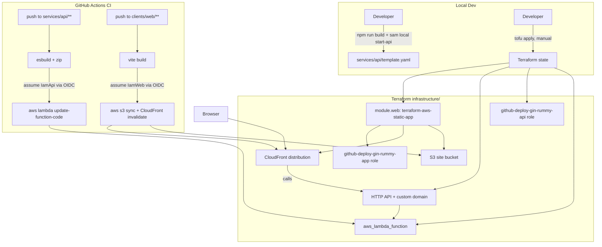

# Requirements

### Overview & Goals
Replace the Serverless-Framework-based scaffolding in `services/api` with a Terraform-managed AWS stack, matching the established pattern already used across this developer's other projects (`resume-api`, `resume-app`, `ledger-api`). A single `infrastructure/` folder at the monorepo root will own:
- The API's Lambda function, IAM role, and HTTP API (API Gateway v2).
- The web client's static hosting (S3 + CloudFront) via the shared `terraform-aws-static-app` module, referenced from its sibling directory on disk (`../terraform-aws-static-app` relative to the repo root).

AWS SAM is kept only as a **local development aid** (`sam local start-api`), not as the deployment mechanism — Terraform owns all real infrastructure, and CI deploys code directly.

### Scope
**In Scope**
- Remove `serverless.yml` and the `serverless`/`serverless-esbuild` dependencies from `services/api`.
- Add a local-only SAM `template.yaml` to `services/api` for `sam local start-api`.
- Create `infrastructure/` at the repo root with Terraform for: Lambda + IAM + HTTP API (API Gateway) for `services/api`, and the static site stack for `clients/web` via `terraform-aws-static-app`.
- Wire a custom domain for both: `gin-rummy.peteshepley.com` (web) and `gin-rummy.api.peteshepley.com` (API), using existing wildcard ACM certs (`peteshepley.com`, `api.peteshepley.com`) looked up via data source — no new certs created.
- Configure remote Terraform state in the shared backend (`peteshepley-ops-tofu-state` S3 bucket / `peteshepley-ops-tofu-locks` DynamoDB table), under a project-specific key.
- Add GitHub Actions workflows that deploy the built API code (`aws lambda update-function-code`) and the built web assets (S3 sync + CloudFront invalidation) using the GitHub OIDC deploy roles Terraform creates.

**Out of Scope**
- Actually running `tofu apply` against a real AWS account (this plan produces the code; applying it is a manual step for the developer, same as the sibling repos).
- Authentication/authorization on the API (no JWT/Clerk authorizer — the gin rummy API has no auth requirement yet).
- Any game logic, database, or additional AWS resources (DynamoDB, etc.) beyond the Lambda/API Gateway/static-site scaffolding.
- Creating the GitHub OIDC provider or ACM certificates themselves — both are assumed to already exist at the AWS account level (same assumption `terraform-aws-static-app`'s README documents).

### Functional Requirements
- `npm run build` in `services/api` still produces a Lambda-ready bundle, now via a plain `esbuild` CLI call instead of `serverless package`.
- Running `sam local start-api` in `services/api` (after a build) serves the same handler locally on the same HTTP API shape production uses.
- `tofu init && tofu plan` (or `terraform`) in `infrastructure/` succeeds and shows the expected resources: Lambda, IAM role, HTTP API, custom domains, and the static-app module's S3/CloudFront/IAM resources.
- Pushing to `main` with changes under `services/api/**` deploys new Lambda code without touching the Lambda's Terraform-managed configuration.
- Pushing to `main` with changes under `clients/web/**` deploys new static assets and invalidates the CloudFront cache.

# Technical Design

### Current Implementation
- `services/api`: `serverless.yml` (Serverless Framework v3 + `serverless-esbuild`) defines an HTTP API with a catch-all Lambda (`src/handler.ts`, `handler.handler`, Node 18). `package.json` has `serverless`/`serverless-esbuild` as devDependencies and `build`/`deploy` scripts that shell out to `serverless`.
- `clients/web`: standard Vite + React + TS scaffold, no deployment wiring yet.
- No `infrastructure/` folder exists yet; root `package.json` workspaces are `services/*` and `clients/*`.
- Sibling repos on disk establish the target pattern precisely:
  - `resume-api/infrastructure/` (`main.tf`, `lambda.tf`, `apigateway.tf`, `domain.tf`, `iam.tf`, `outputs.tf`, `lambda-placeholder/`): Terraform owns the Lambda's IAM role, log group, and function (created from a placeholder zip, with `lifecycle { ignore_changes = [filename, source_code_hash] }` so CI-driven deploys aren't clobbered by `tofu apply`), plus an HTTP API (API Gateway v2) with AWS_PROXY integration and a custom domain backed by a looked-up wildcard ACM cert.
  - `resume-api`/`ledger-api`'s `.github/workflows/deploy.yml`: builds the code (`esbuild`/`pip`), zips it, assumes an OIDC deploy role, and runs `aws lambda update-function-code` + `aws lambda wait function-updated`. No Terraform apply happens in CI.
  - `ledger-api/template.yaml`: an explicitly **local-only** SAM template (`sam local start-api`) that mirrors the production HTTP API shape for local dev, with a comment stating it "is not deployed anywhere itself."
  - `resume-app/infrastructure/main.tf`: a thin wrapper that just calls `module "app" { source = "github.com/PeteShepley/terraform-aws-static-app" ... }` and re-exports its outputs.
  - `terraform-aws-static-app` (sibling dir, one level up from `gin-rummy-app`): reusable module for S3 + CloudFront + GitHub OIDC deploy role, assuming an existing wildcard ACM cert and an existing account-level GitHub OIDC provider.

### Key Decisions
1. **Terraform owns all real infrastructure; SAM is local-only.** `infrastructure/` creates the Lambda, IAM role, and API Gateway directly via `aws_lambda_function`/`aws_apigatewayv2_*` resources (not a SAM/CloudFormation stack). `services/api/template.yaml` exists solely for `sam local start-api` and is never deployed — exactly the `ledger-api` pattern. *(Confirmed with user.)*
2. **Real subdomains, not placeholders.** Web: `gin-rummy.peteshepley.com` (cert: `peteshepley.com` wildcard). API: `gin-rummy.api.peteshepley.com` (cert: `api.peteshepley.com` wildcard, same convention as `resume.api.peteshepley.com`). *(Confirmed with user.)*
3. **Shared remote state backend.** `infrastructure/main.tf` uses the same `s3` backend as every sibling repo: bucket `peteshepley-ops-tofu-state`, DynamoDB lock table `peteshepley-ops-tofu-locks`, region `us-east-1`, with a project-specific key `apps/gin-rummy-app/terraform.tfstate` (one combined state for both the API and web stacks, since they live in one repo/one `infrastructure/` folder). *(Confirmed with user.)*
4. **Code deploy stays split from infra, like every sibling repo.** Terraform never touches Lambda code or S3 object contents after creation (`ignore_changes` on the Lambda; the static-app module's bucket has no content-managing resource). CI does `aws lambda update-function-code` for the API and `aws s3 sync` + CloudFront invalidation for the web app — no `tofu apply` runs in CI.
5. **Module referenced by local relative path**, as the user requested: `source = "../../terraform-aws-static-app"` (relative to `infrastructure/`, since that sibling directory sits one level above `gin-rummy-app`'s own root). This only matters for `tofu plan/apply`, which per Decision 4 is a manual, local-machine step — so the path being local-only is not a CI blocker.
6. **No auth on the HTTP API for now.** Unlike `resume-api`'s JWT-authorized routes, gin rummy has no auth requirement yet, so the route is a simple `ANY /{proxy+}` with no authorizer — simpler than the `resume-api` per-verb-route workaround (which exists only to keep `OPTIONS` away from a JWT authorizer that doesn't exist here).

### Proposed Changes
**`services/api`** — drop Serverless Framework:
- Delete `serverless.yml`.
- `package.json`: remove `serverless`/`serverless-esbuild`; replace `build`/`deploy` scripts with a direct `esbuild` CLI build (`esbuild src/handler.ts --bundle --platform=node --target=node22 --outfile=dist/index.js`) and a `start:local` script (`npm run build && sam local start-api`); drop the old `deploy` script (deployment now happens via CI, see below).
- Add `template.yaml` (local-only SAM template, `AWS::Serverless-2016-10-31`, `nodejs22.x`, `Handler: index.handler`, `CodeUri: dist/`, an `HttpApi` event on `/{proxy+}` `ANY`), annotated the same way `ledger-api/template.yaml` is ("mirrors prod, never deployed").
- `src/handler.ts` is unchanged — it already matches the `APIGatewayProxyEvent`/`Result` shape both API Gateway and `sam local` expect.
- Update `README.md` to describe the Terraform + `sam local` workflow instead of Serverless.

**`infrastructure/`** (new, repo root):
- `main.tf` — `terraform`/`backend "s3"` block (shared state backend) and `provider "aws"`.
- `variables.tf` — `aws_region`, `github_repo` (`PeteShepley/gin-rummy-app`), `site_bucket_name`, `domain_name`, `root_domain_name`, `api_domain_name`, `api_root_domain_name`, `cors_allowed_origins`.
- `lambda.tf` — `archive_file` placeholder zip (from `lambda-placeholder/index.js`), `aws_iam_role` + basic-execution policy attachment, `aws_cloudwatch_log_group`, and `aws_lambda_function` with `lifecycle { ignore_changes = [filename, source_code_hash] }` — the same placeholder-ownership split as `resume-api/lambda.tf`.
- `lambda-placeholder/index.js` — trivial `exports.handler` returning a 200, just enough for `tofu apply` to succeed before any real code is deployed.
- `apigateway.tf` — `aws_apigatewayv2_api` (HTTP, native CORS via `cors_allowed_origins`), `aws_apigatewayv2_integration` (AWS_PROXY, payload format 2.0), a single `ANY /{proxy+}` route (no authorizer), `aws_apigatewayv2_stage` (`$default`, auto-deploy), and `aws_lambda_permission` for API Gateway invoke.
- `api-domain.tf` — looks up the `api.peteshepley.com` wildcard cert via `data "aws_acm_certificate"`, creates `aws_apigatewayv2_domain_name` for `gin-rummy.api.peteshepley.com`, and `aws_apigatewayv2_api_mapping`.
- `iam.tf` — looks up the account's GitHub OIDC provider via data source, creates a `github-deploy-gin-rummy-api` role trust-scoped to `var.github_repo`, with a policy limited to `lambda:UpdateFunctionCode`/`GetFunction`/`GetFunctionConfiguration` on the one function ARN.
- `web.tf` — `module "web" { source = "../../terraform-aws-static-app" ... }` wired with `app_name = "gin-rummy-app"`, `site_bucket_name`, `domain_name`, `root_domain_name`, `distribution_comment`, `github_repo` — the web module creates its own GitHub deploy role internally, so no extra IAM is needed here.
- `outputs.tf` — re-exports everything CI/DNS need: `module.web`'s bucket/CloudFront/deploy-role outputs, plus the API's function name/ARN, invoke URL, custom domain target + hosted zone ID, and its own GitHub deploy role ARN.
- `README.md` — how to `tofu init`/`plan`/`apply` this stack, and which outputs feed which GitHub Actions secrets/variables.

**Root `.gitignore`** — add `.terraform/`, `*.tfstate*`, `.aws-sam/`, `function.zip` (keep `.terraform.lock.hcl` tracked, matching normal Terraform convention).

**`.github/workflows/`** (new):
- `deploy-api.yml` — triggers on push to `main` touching `services/api/**`; `npm ci` + `npm run build --workspace=api`; zips `dist/`; assumes `secrets.AWS_ROLE_ARN_API`; `aws lambda update-function-code` + `wait function-updated` against `vars.LAMBDA_FUNCTION_NAME`.
- `deploy-web.yml` — triggers on push to `main` touching `clients/web/**`; `npm ci` + `npm run build --workspace=web`; assumes `secrets.AWS_ROLE_ARN_WEB`; `aws s3 sync dist/ s3://<vars.SITE_BUCKET_NAME> --delete`; `aws cloudfront create-invalidation` against `vars.CLOUDFRONT_DISTRIBUTION_ID`.

### File Structure
```
gin-rummy-app/
├── .github/workflows/
│   ├── deploy-api.yml        (new)
│   └── deploy-web.yml        (new)
├── infrastructure/           (new)
│   ├── main.tf
│   ├── variables.tf
│   ├── lambda.tf
│   ├── lambda-placeholder/index.js
│   ├── apigateway.tf
│   ├── api-domain.tf
│   ├── iam.tf
│   ├── web.tf
│   ├── outputs.tf
│   └── README.md
├── services/api/
│   ├── serverless.yml        (removed)
│   ├── template.yaml         (new, local-only SAM)
│   ├── package.json          (modified)
│   └── README.md             (modified)
└── .gitignore                (modified)
```

### Architecture Diagram


### Risks
- **Local module path only works on this developer's machine** (`../../terraform-aws-static-app` assumes the sibling repo is checked out at that exact relative location). Acceptable because, per Decision 4, `tofu apply` is a manual local step in every sibling repo too — never run in CI.
- **First `tofu apply` will fail** if the account-level GitHub OIDC provider or the two wildcard ACM certs (`peteshepley.com`, `api.peteshepley.com`) don't already exist — both are looked up via data source, not created here, matching the existing convention.
- **State key collision**: using one combined state key for both API and web stacks (unlike sibling repos' per-service repos/keys) means a `tofu apply` touching one also re-evaluates the other; low risk here since both are small, but worth documenting in `infrastructure/README.md`.

# Testing

### Validation Approach
Since this scaffolding can't be deployed to real AWS from this environment, validation focuses on static/local checks the agent can run directly.

### Key Scenarios
- `npm run build --workspace=api` succeeds and produces `services/api/dist/index.js` with no `serverless`-related scripts/deps remaining in `package.json`.
- `sam validate` (or at least a lint of `services/api/template.yaml`'s YAML/CloudFormation shape) confirms the local-only template is well-formed.
- `tofu fmt -check`/`terraform fmt -check` and `tofu validate`/`terraform validate` (with a `tofu init -backend=false`) succeed for the new `infrastructure/` folder, confirming HCL syntax and internal references (variables, module inputs) are correct without needing real AWS credentials or the remote backend.
- `npm run build --workspace=web` still succeeds unaffected by these changes.
- YAML lint / `act`-free sanity check of the two new GitHub Actions workflow files (correct trigger paths, correct secret/variable names referenced consistently between the workflow and `infrastructure/outputs.tf`'s documented mapping).

### Edge Cases
- Confirm `lifecycle { ignore_changes = [filename, source_code_hash] }` is present on `aws_lambda_function.api` so a future `tofu apply` can't accidentally revert a CI-deployed Lambda back to the placeholder.
- Confirm the HTTP API's `ANY /{proxy+}` route and native CORS config don't conflict (no authorizer is attached here, so this is simpler than `resume-api`'s workaround, but still worth a explicit check).
- Confirm `infrastructure/main.tf`'s backend `key` is unique (`apps/gin-rummy-app/terraform.tfstate`) and doesn't collide with any existing sibling-repo state key.

# Delivery Steps

### ✓ Step 1: Remove Serverless Framework and add local-only SAM tooling to services/api
services/api builds with plain esbuild and can be run locally via `sam local start-api`, with no Serverless Framework dependency left.
- Delete `services/api/serverless.yml`.
- Update `services/api/package.json`: remove `serverless`/`serverless-esbuild` devDependencies; replace the `build` script with a direct `esbuild src/handler.ts --bundle --platform=node --target=node22 --outfile=dist/index.js` call; add a `start:local` script (`npm run build && sam local start-api`); drop the old `deploy` script.
- Add `services/api/template.yaml`: a local-only AWS SAM template (`nodejs22.x`, `Handler: index.handler`, `CodeUri: di/`/`, `HttpApi` event on `ANY /{proxy+}`), commented as never deployed — mirrors the `ledger-api/template.yaml` convention.
- Update `services/api/README.md` to document the new build/local-dev flow (esbuild + `sam local`) instead of Serverless Framework commands.
- Update the root `.gitignore` to add `.aws-sam/` and `function.zip`.

### ✓ Step 2: Scaffold the API's Lambda + API Gateway Terraform stack
A new `infrastructure/` folder at the repo root defines the Lambda function, its IAM role, and an HTTP API in Terraform, with a placeholder-code pattern that lets code deploys happen independently.
- Create `infrastructure/main.tf` with the `terraform`/`backend "s3"` block (bucket `peteshepley-ops-tofu-state`, key `apps/gin-rummy-app/terraform.tfstate`, DynamoDB lock table `peteshepley-ops-tofu-locks`) and the `aws` provider.
- Create `infrastructure/variables.tf` with `aws_region`, `github_repo`, `api_domain_name` (`gin-rummy.api.peteshepley.com`), `api_root_domain_name` (`api.peteshepley.com`), and `cors_allowed_origins`.
- Create `infrastructure/lambda-placeholder/index.js` (trivial handler) and `infrastructure/lambda.tf` (`archive_file`, IAM role + basic-execution policy, CloudWatch log group, `aws_lambda_function` with `lifecycle { ignore_changes = [filename, source_code_hash] }`).
- Create `infrastructure/apigateway.tf` (`aws_apigatewayv2_api` with native CORS, AWS_PROXY integration, `ANY /{proxy+}` route with no authorizer, `$default` auto-deploy stage, Lambda invoke permission).
- Create `infrastructure/api-domain.tf` (data lookup of the `api.peteshepley.com` wildcard cert, `aws_apigatewayv2_domain_name` for `gin-rummy.api.peteshepley.com`, `aws_apigatewayv2_api_mapping`).
- Create `infrastructure/iam.tf` (GitHub OIDC provider data source, `github-deploy-gin-rummy-api` role scoped to `lambda:UpdateFunctionCode`/`GetFunction`/`GetFunctionConfiguration` on this one function).

### ✓ Step 3: Add the web app's static-site infrastructure via terraform-aws-static-app
The same `infrastructure/` stack provisions the web client's S3 + CloudFront hosting by calling the shared module from its sibling directory, and all outputs are exposed together.
- Extend `infrastructure/variables.tf` with `site_bucket_name` (`peteshepley-gin-rummy-app-site`), `domain_name` (`gin-rummy.peteshepley.com`), `root_domain_name` (`peteshepley.com`).
- Create `infrastructure/web.tf` with `module "web" { source = "../../terraform-aws-static-app" ... }`, passing `app_name`, `site_bucket_name`, `domain_name`, `root_domain_name`, `distribution_comment`, `github_repo`.
- Create `infrastructure/outputs.tf` re-exporting the web module's bucket/CloudFront/deploy-role outputs alongside the API's function name/ARN, invoke URL, custom domain target, and its GitHub deploy role ARN.
- Add `infrastructure/README.md` documenting how to `tofu init`/`plan`/`apply` this stack and which outputs map to which GitHub Actions secrets/variables.
- Update the root `.gitignore` to add `.terraform/` and `*.tfstate*` (keep `.terraform.lock.hcl` tracked).

### ✓ Step 4: Add GitHub Actions workflows to deploy API and web code through the new infrastructure
Pushing to main deploys the API Lambda's code and the web app's static assets using the OIDC deploy roles Terraform created, without ever running `tofu apply` in CI.
- Create `.github/workflows/deploy-api.yml`: triggers on push to `main` touching `services/api/**`; runs `npm ci` + `npm run build --workspace=api`; zips `dist/`; assumes `secrets.AWS_ROLE_ARN_API` via OIDC; runs `aws lambda update-function-code` and `aws lambda wait function-updated` against `vars.LAMBDA_FUNCTION_NAME`.
- Create `.github/workflows/deploy-web.yml`: triggers on push to `main` touching `clients/web/**`; runs `npm ci` + `npm run build --workspace=web`; assumes `secrets.AWS_ROLE_ARN_WEB` via OIDC; runs `aws s3 sync dist/ s3://<vars.SITE_BUCKET_NAME> --delete` and `aws cloudfront create-invalidation` against `vars.CLOUDFRONT_DISTRIBUTION_ID`.
- Document the required repo secrets (`AWS_ROLE_ARN_API`, `AWS_ROLE_ARN_WEB`) and variables (`LAMBDA_FUNCTION_NAME`, `SITE_BUCKET_NAME`, `CLOUDFRONT_DISTRIBUTION_ID`) in `infrastructure/README.md`, matching the Terraform outputs each one comes from.